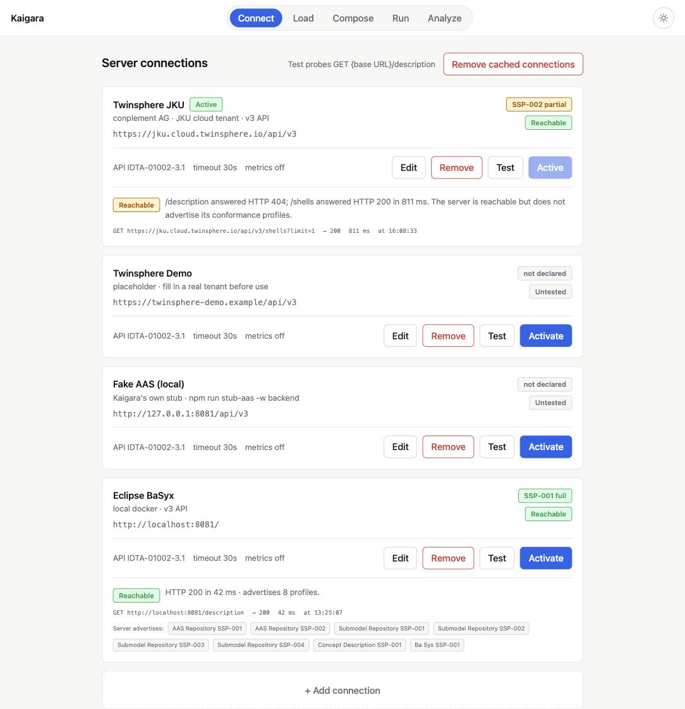
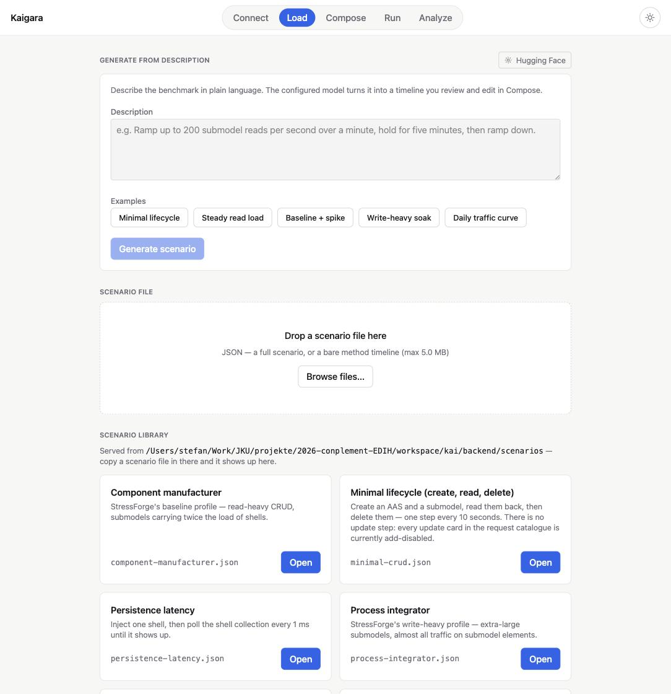
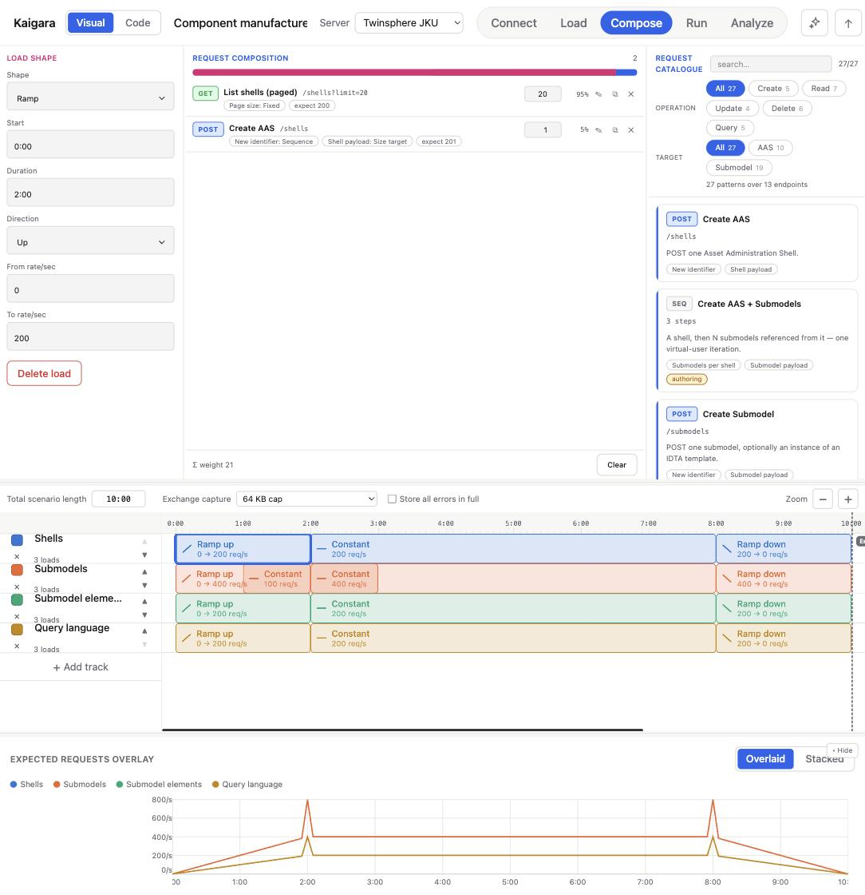
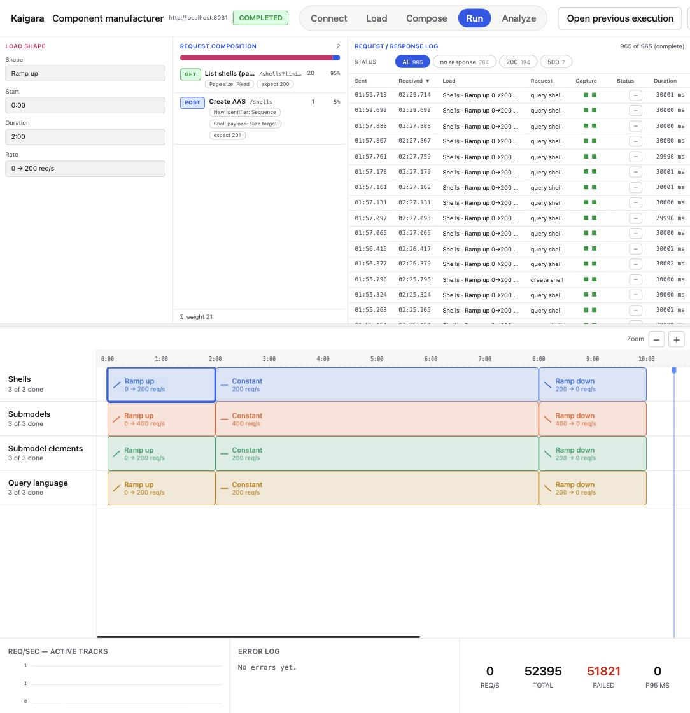
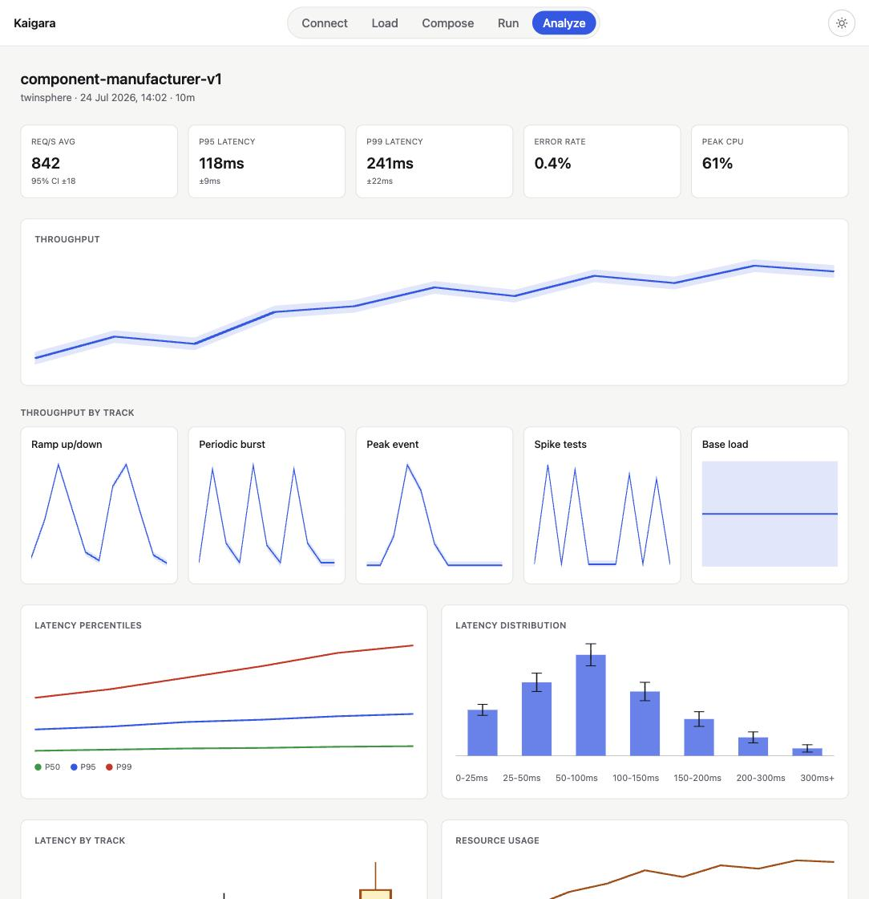

# Walkthrough

Kaigara takes you through five phases, always in the same order, always reachable from the same
pill nav at the top of the screen: **Connect → Load → Compose → Run → Analyze**. This page walks
through what each one is for and what to look at. For how to get the tool running in the first
place, see the [root README](../README.md).

## 1. Connect

Connect is where you tell Kaigara which AAS server(s) you might want to benchmark. Each entry is a
base URL plus whatever the server needs on every request — a timeout, and any headers such as an
`Authorization` bearer token or an API key.

What's worth noticing:

- **Test** runs a standards-only reachability and conformance probe: it asks the server for its
  IDTA-01002 Service Description (`GET {baseUrl}/description`), falling back to `GET {baseUrl}/shells`
  for servers that don't implement it, and reports latency, HTTP status, and which conformance
  profiles the server actually advertises (`SSP-001`, `SSP-002`, …). A server can be reachable but
  not advertise anything — that's shown as a distinct state, not hidden behind a green checkmark.
- **Activate** picks the one connection every later screen targets. Only one connection is active
  at a time, and it's shown in the header from Compose onward, so it's always visible what a
  composed timeline is about to run against.
- Connections are a plain list, editable and removable, kept only in the browser for now (no
  server-side connection management yet).

## 2. Load

Load is where a benchmark scenario gets onto the Compose canvas, three ways:

- **Generate from description** turns a plain-language description ("ramp up to 200 submodel
  reads per second over a minute, hold for five minutes, then ramp down") into a scenario, via an
  LLM step that runs entirely in the browser (you bring your own API key; see the frontend README).
  A handful of ready-made example descriptions are one click away.
- **Drop or pick a file** loads a scenario JSON document directly — either a full scenario or a
  bare load timeline.
- **The scenario library** is a folder of scenario files the backend serves as cards. It ships with
  a handful of demo scenarios (one showing off every load shape, a minimal CRUD lifecycle, three
  scenarios adapted from conplement's own StressForge profiles, and more) and picks up anything you
  drop into that folder without a restart. A file that fails to parse still shows up, as an
  unopenable card naming exactly what's wrong with it — "my scenario went missing" is a worse
  failure than a clearly broken card.

Opening any of the three lands you on Compose with that scenario loaded.

## 3. Compose

Compose is the editor, and the one screen most of the interesting work happens on. A scenario is a
set of **tracks**, each holding a sequence of **loads** — a shape (ramp, constant, spike, sine,
bell, or a literal one-off count) over a time window, sending a weighted mix of requests.

What to look at:

- **The track canvas** (bottom) is a timeline: drag a load to move it, resize it, or add a new one.
  The **expected-requests overlay** underneath previews the resulting request-rate curve before
  anything runs, so a shape's effect on the actual load is visible immediately, not only after a run.
- **Load shape** (left column) is the selected load's timing and rate parameters.
- **Request composition** (middle column) is what that load actually sends: a weighted list of
  request patterns, each with its own identifier strategy and payload.
- **Request catalogue** (right column) is where those patterns come from — a library of IDTA-01002
  request shapes (create/read/update/delete/query against shells and submodels, plus a few
  multi-step sequences) to pick from and fill in.
- The header toggle between **Visual** and **Code** is not an editor-plus-export: both are the same
  underlying JSON document, so what the Code view shows is byte-for-byte what a run actually
  executes. Rename, Upload, Download and **Edit with AI** (an LLM instruction applied to the whole
  timeline) all live in the same header.

Pressing **Run** in the header doesn't start anything by itself — it only opens the Run screen with
this timeline ready to go.

## 4. Run

Run executes the composed timeline against the active connection, through k6, and streams the
results back live.

What to look at:

- **Req/sec, error log and summary stats** (bottom bar) update roughly once a second while a run is
  live, and stay in place once it finishes.
- **The timeline** mirrors Compose's own canvas, now showing progress against the playhead while a
  run is live; once it's done, it goes back to plain click-to-select, the same as Compose.
- **Request / response log** (top right, click a load on the timeline to populate it) is the
  per-request detail: every request's send/receive time, which load it belongs to, its status and
  duration, and a **Capture** column showing whether the request and response bodies were stored in
  full or capped at 64 KB (configurable per scenario). Every column header is sortable. Clicking a
  row with a captured exchange opens the literal request and response that were sent and received.
- **Concrete plan** (header toggle) shows the compiled, time-ordered request schedule — exactly what
  the engine is about to do, or did — without needing to run anything to see it.
- **Open previous execution** reopens an earlier run from the on-disk archive, so results survive a
  backend restart even though live run state does not (yet).

A dropped-iteration warning, if one shows up, means the load generator itself couldn't keep up —
that's the tool being the bottleneck, not the server, and it invalidates the measurement.

## 5. Analyze

> **⚠️ This screen is a mockup. It is not connected to anything.**
> Every chart and number here is static, hand-authored placeholder data (`lib/mock/analysis.ts` in
> the frontend), not the result of the run you just watched on the Run screen. It exists to show
> what the finished analysis experience is meant to look like — per-track throughput, latency
> percentiles and their distribution, resource usage correlated against the load — none of which is
> wired up to real results yet. Do not read anything on this screen as a real measurement.

The intent, once this is real: turn a completed run's raw samples into the kind of report you'd
actually take to a decision — where the latency comes from, whether a particular track or request
type is disproportionately expensive, and whether the target's own CPU/memory tracked the load or
fell over independently of it.
